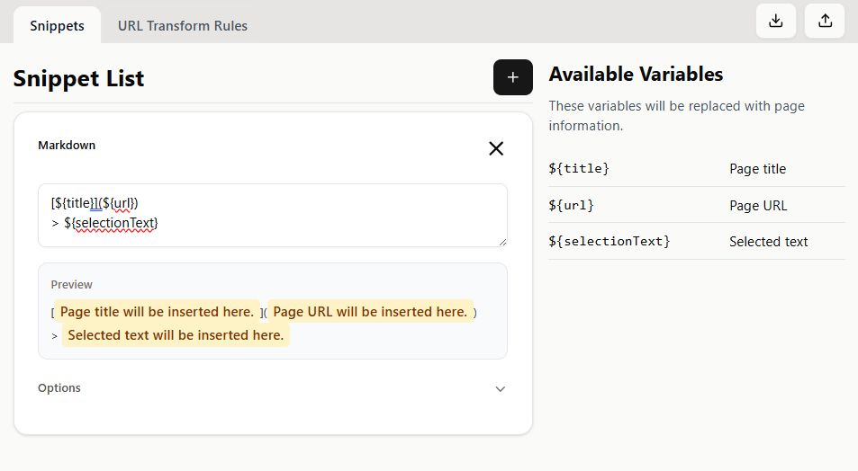
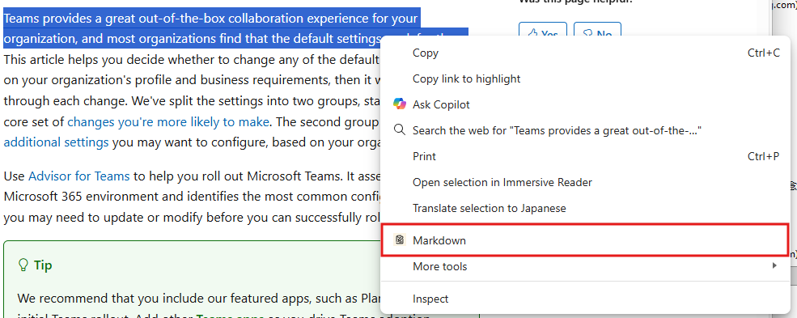

# Custom Copy

<div align="center">


テキストをコピーする際に、任意の形式に自動整形できるChrome拡張機能です。

[Chrome Web Store](https://chromewebstore.google.com/detail/custom-copy/mdkihjamcddnifdkigeigifgoafgkfbi) | [使い方](#使用方法) | [機能](#主な機能)

</div>

---

## 📖 概要

**Custom Copy** は、Webページからテキストをコピーする際に、事前に設定したテンプレートに基づいて自動的に整形してクリップボードにコピーできる Chrome 拡張機能です。

マークダウン形式でのリンク作成、引用形式でのコピー、独自フォーマットでの情報整理など、様々なシーンで活用できます。

### 主な機能

- ✨ **カスタムテンプレート**: 自由にテンプレートを作成・管理
- 🔄 **変数置換**: ページタイトル、URL、選択テキストを自動挿入
- 🎯 **右クリックメニュー**: コンテキストメニューから簡単にアクセス
- ⌨️ **キーボードショートカット**: Ctrl+Shift+1 ~ 4 で素早くコピー
- 📝 **複数テンプレート**: 用途に応じて複数のテンプレートを使い分け
- 🎨 **直感的なUI**: わかりやすいオプション画面で簡単設定
- 🔍 **変換ルール**: URLを正規表現で変換可能

---

## 🚀 使用方法

### 1. テンプレートの作成

拡張機能アイコンをクリックして「オプション」を開き、新しいテンプレートを作成します。



**例: マークダウンリンク形式**
```
[${selectionText}](${url})
```

**例: 引用形式**
```
> ${selectionText}
出典: ${title} (${url})
```

### 2. テキストの選択とコピー

1. Web ページ上でコピーしたいテキストを選択
2. 右クリックしてコンテキストメニューを表示
3. [Custom Copy] > 作成したテンプレート名を選択
   ※ テンプレートが 1 つの場合にはそのテンプレートのみが表示されます。



### 3. キーボードショートカットの設定（オプション）

よく使うスニペットにキーボードショートカットを割り当てることができます。

1. オプション画面で各スニペットの「Options」を展開
2. 「Keyboard Shortcut」から Ctrl+Shift+1 ~ 4 のいずれかを選択
3. ページ上でテキストを選択し、設定したショートカットキーを押すだけでコピー完了

**注意**: 複数のスニペットに同じショートカットを割り当てた場合、最初に見つかったスニペットが実行されます。

### 4. クリップボードにコピー完了

選択したテンプレート形式で、クリップボードにコピーされます。

---

## 📋 テンプレート変数

テンプレート内で以下の変数を使用できます：

| 変数 | 説明 | 例 |
| --- | --- | --- |
| `${title}` | ページのタイトル | `GitHub - トップページ` |
| `${url}` | ページのURL | `https://github.com` |
| `${selectionText}` | 選択したテキスト | `選択された任意のテキスト` |
| `${section}` | 選択したテキストの最も近い見出し（h1-h6） | `はじめに` |

---

## 🔧 変換ルール

ページのURLを正規表現を使って変換することができます。テンプレートとは別に「変換ルール」を設定することで、`${url}` 変数の値を自動的に加工できます。

### 使用例

**変換ルール設定:**
- 検索パターン: `https://`
- 置換文字列: `http://`

**結果:**
URLのプロトコル部分が `https://` から `http://` に変換されます。

**活用例:**
- URLのクエリパラメータを削除
- 特定のドメイン部分を置換
- URLの一部を短縮形式に変換

---

## 💡 テンプレート例

### マークダウンリンク
```
[${selectionText}](${url})
```

### 引用付きリンク
```
> ${selectionText}

[${title}](${url})
```

### HTML形式
```html
<a href="${url}" title="${title}">${selectionText}</a>
```

### メモ形式
```
【参考】${title}
内容: ${selectionText}
URL: ${url}
```

### 箇条書き形式
```
- ${selectionText} - [${title}](${url})
```

---

## 🛠️ 開発

### 必要な環境

- Node.js (v18以上推奨)
- npm または yarn

### セットアップ

```bash
# リポジトリのクローン
git clone https://github.com/Yuta-31/customCopy.git
cd customCopy

# 依存関係のインストール
npm install

# 開発ビルド
npm run build

# 本番ビルド
npm run build:prod
```

**Chrome に拡張機能を追加:**

1. Chrome を開き、アドレスバーに `chrome://extensions/` と入力
2. 右上の「デベロッパーモード」をオンに切り替え
3. 「パッケージ化されていない拡張機能を読み込む」をクリック
4. ビルドで生成された `dist` フォルダを選択
5. 拡張機能が追加され、すぐに使用可能になります

### 技術スタック

- **フレームワーク**: React 18
- **ビルドツール**: Vite 7
- **言語**: TypeScript 5.9
- **スタイリング**: Tailwind CSS 4
- **UI コンポーネント**: shadcn/ui + Radix UI
- **アイコン**: Lucide React
- **テスト**: Vitest
- **リント**: ESLint

---

## 📄 ライセンス

MIT License
public/LICENSE ファイルを参照してください。

---

## 🔗 リンク

- [Chrome Web Store](https://chromewebstore.google.com/detail/custom-copy/mdkihjamcddnifdkigeigifgoafgkfbi)
- [Issues](https://github.com/Yuta-31/customCopy/issues)

---

## 📝 更新履歴

### v2.1.0 (2025-12-30)

- **キーボードショートカット機能**: Ctrl+Shift+1 ~ 4 のショートカットキーでスニペットを素早く実行可能に
- **ダークモード対応**: システムテーマに対応し、ライト/ダークテーマの切り替えが可能に
- **設定メニューの追加**: オプション画面にテーマ切り替えの設定メニューを実装

### v2.0.0 (2025-12-29)

- **セクション見出しの抽出機能**: `${section}` 変数を追加し、選択したテキストの最も近い見出し（h1-h6）を取得可能に
- **URL 変換ルール機能**: 正規表現を使用した URL の自動変換機能を追加
- **UI の大幅リニューアル**: shadcn/ui を使用したモダンな UI デザインに刷新
- **スニペットのインポート/エクスポート**: 設定のバックアップと他の環境への共有が可能に
- **テストの追加**: ファイル処理、ストレージ、URL 変換、テンプレートに関する包括的なテストを実装
- **ログ機能の強化**: デバッグとトラブルシューティングのための logging 機能を改善

### v1.1.0 (2025-12-28)

- オプション画面の UI 改善
- パフォーマンスの最適化
- クエリ削除機能の追加
- React 18、Vite 7、TypeScript 5.9、Tailwind CSS 4 へ移行

### v1.0.0 (初回リリース)

- 基本的なテンプレート機能
- コンテキストメニューからのコピー
- ページタイトル、URL、選択テキストの変数対応
- オプション画面の実装
